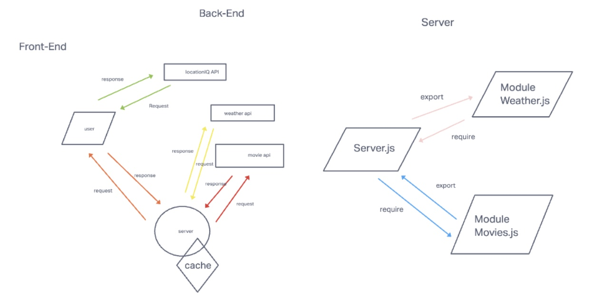

# City-Explorer-API

**Author**: Marcus Hartwig

**Version**: 1.5.0 
<!-- (increment the patch/fix version number if you make more commits past your first submission) --> 

## Overview
<!-- Provide a high level overview of what this application is and why you are building it, beyond the fact that it's an assignment for this class. (i.e. What's your problem domain?) -->
  * City-Explorer-API exist to be the back-end support for its front-end counterpart. This includes the programing of a cache support system for both weather data and movie data when a user inputs a city. 

## Getting Started
<!-- What are the steps that a user must take in order to build this app on their own machine and get it running? -->
  * To duplicate the built one must install EXPRESS, DOTENV, CORS, NODEMON, REACT, AXIOS, as well as provide their own API information..

## Architecture
<!-- Provide a detailed description of the application design. What technologies (languages, libraries, etc) you're using, and any other relevant design information. -->
  * Technologies involved include - REACT, JAVASCRIPT, API'S
  * WRRC IMGs are at the bottom. 

<!-- ## Change Log -->
<!-- Use this area to document the iterative changes made to your application as each feature is successfully implemented. Use time stamps. Here's an example:

01-01-2001 4:59pm - Application now has a fully-functional express server, with a GET route for the location resource. -->

## Credit and Collaborations
//> Chris Yamas

//> Thomas Basham

//> Abdinasir Yussuf

//> Jess Parker *encouragement*

//> Tai Egashira

//> Nathan Waters

//> Eden Brekke

//> Roger Wells

//> Eden Brekke **MY PERSON FOR THIS PROJECT**

//> Benjamin Carder

//> Elle Svete

//> Dwight Lindquist

//> Bishal Khanal

//> Instructor David

//> Sheyna Watkins

//> JB Tellez

//> Nathan Waters

//> Cameron Walden

//> Audrey Patterson *encouragement*

//> Denise & Mei Li Hartwig *for my motivation levels*
<!-- Give credit (and a link) to other people or resources that helped you build this application. -->

## Time Estimates
<!-- For each of the lab features, make an estimate of the time it will take you to complete the feature, and record your start and finish times for that feature: -->

Name of feature: _Lab07
Estimate of time needed to complete: _All of it_
Start time: ___3pm__
Finish time: ___never__
Actual time needed to complete: __many__

/////////////////////////////////////////////////////////

Name of feature: _Lab08
Estimate of time needed to complete: _All of it_
Start time: ___2pm__
Finish time: ___9pm__
Actual time needed to complete: __7hrs__

/////////////////////////////////////////////////////////

Name of feature: _Lab09
Estimate of time needed to complete: _All of it_
Start time: ___1pm__
Finish time: ___10pm__
Actual time needed to complete: __9hrs__

/////////////////////////////////////////////////////////

Name of feature: _Lab010
Estimate of time needed to complete: _All of it_
Start time: ___1pm__
Finish time: ___6pm__
Actual time needed to complete: __5hrs__

## WRRC
LAB06

LAB07

LAB08

LAB09

LAB 010
